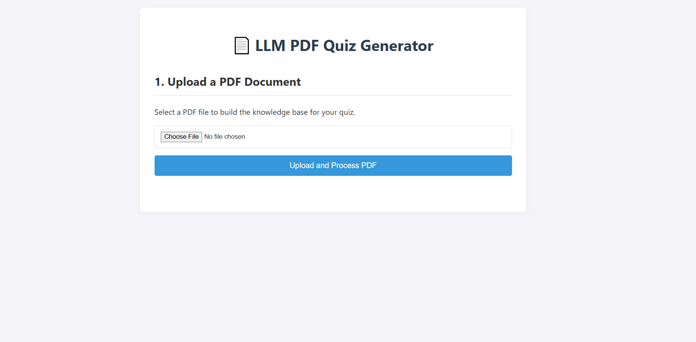

# PDF-To-Quiz Generator Using Ollama
Ryan Don

100824494

Dec 2, 2025

CSCI 4440U

---

This app uses a local Ollama model to generate quizzes based off an uploaded PDF. There are safety measures for malicious use of the LLM, testing for the responses, and logging for the requests. This was a fun little project to make, and [].



## App Overview

### How it Works

The app works in two main stages:

1. **PDF Upload & Ingestion**: This process uses RAG to handle the PDF ingestion. When you upload a PDF, the app extracts all text from it and splits it into manageable chunks. These chunks are converted into embeddings (numerical representations) and stored in a vector database using FAISS.

2. **Quiz Generation**: When you request a quiz on a specific topic, the app:
   - Searches the vector database for the most relevant chunks related to your topic
   - Passes those chunks as context to a local Ollama LLM model
   - The model generates 3 multiple-choice questions based only on the provided context
   - Safety checks ensure the input topic is appropriate before generation
   - Results are logged for telemetry and debugging

All processing happens locally using Ollama.

### Endpoints

`/`

**Home** ["GET"]

Just renders the .html template

---

`/upload_pdf`

**Upload PDF** ["POST"]

Takes a .pdf file in the request. Extracts the text from the PDF and injests into the vector DB.

---

`/generate_quiz`

**Generate Quiz Route** ["POST"]

Retrieves the text chunks from the vector DB, calls the LLM to generate a quiz in proper JSON format.

## How to run

Ollama requirements
```Shell
# Make sure the correct ollama models are pulled and running on your machine
ollama pull llama3.2:3b         # Used for generating the quiz
ollama pull nomic-embed-text    # Used for the vector search
```

Run the python script
```Shell
python -m venv venv
./venv/scripts/activate
pip install -r requirements.txt

cd local-llm-quiz-app # Make sure you're in root, NOT /app/
python -m app.main
```

## Enhancements

As described previously, this app uses RAG, where data is loaded into a database which the local model can access when producing it's prompts.

I use two models: `llama3.2:3b` and `nomic-embed-text`. llama3 is best at making quizzes, and this was originally the only model I was using. This model isn't great with vector search, however, so I used nomic-embed-text for this job. 

In short, `llm.py` uses `llama3.2:3b`, `rag.py` uses `nomic-embed-text`.

## Safety

The app has prompt protection for malicious phrases. This isn't entirely necessary, however, as the prompt is predetermined. Once the PDF is parsed, however, prompts could be injected from there. Thus the forbidden phrase check works in this case.

## Telemetry

Requests are logged to the `/logs` directory, to the `requests.jsonl` file. Here, the type of request, endpoint, topic, and latency are all recorded.

## Offline Eval

There are tests to evaluate nearly everything used in this project. You should try running them, it's super cool.

Running the tests:
```Shell
cd local-llm-quiz-app   # Again, make sure you're in root. Not in /test/
python -m tests.run_tests
```